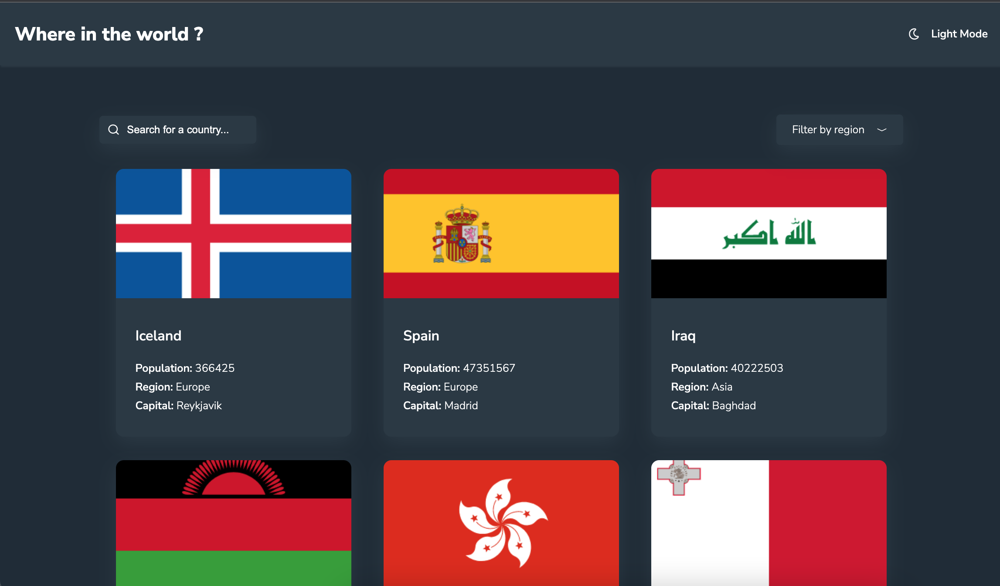

# Frontend Mentor - REST Countries API with color theme switcher solution

This is a solution to the [REST Countries API with color theme switcher challenge on Frontend Mentor](https://www.frontendmentor.io/challenges/rest-countries-api-with-color-theme-switcher-5cacc469fec04111f7b848ca). Frontend Mentor challenges help you improve your coding skills by building realistic projects. 

## Table of contents

- [Overview](#overview)
  - [The challenge](#the-challenge)
  - [Screenshot](#screenshot)
  - [Links](#links)
- [My process](#my-process)
  - [Built with](#built-with)
  - [What I learned](#what-i-learned)
  - [Continued development](#continued-development)
  - [Useful resources](#useful-resources)
- [Author](#author)

## Overview

### The challenge

Users should be able to:

- See all countries from the API on the homepage
- Search for a country using an `input` field
- Filter countries by region
- Click on a country to see more detailed information on a separate page
- Click through to the border countries on the detail page
- Toggle the color scheme between light and dark mode

### Screenshot

### Links

- Solution URL: [Solution URL here](https://github.com/tania0808/countries-search)
- Live Site URL: [Live site here](https://search-countries-tania-his.netlify.app/)

## My process

### Built with

- React
- Styled-Components
- Redux
- TypeScript
- [React](https://reactjs.org/) - JS library
- [TypeScript](https://www.typescriptlang.org/docs/handbook/react.html) - for typing
- [Styled Components](https://styled-components.com/) - For styles

### What I learned

- useFetch hook
- Debouncing API calls
- TypeScript

### Continued development

All learned things

### Useful resources

- [Theme Toggler](https://dev.to/viniciusmdias/how-to-create-a-theme-in-react-typescript-with-styled-components-3fn) - This helped me for building Theme Toggler. I really liked this pattern and will use it going forward.

## Author

- Website - [Tania](https://portfolio-tania-his.netlify.app/)
- Linkedin - [Tetiana His](https://www.linkedin.com/in/tetiana-his/)
- Github - [@tania0808](https://github.com/tania0808/)
